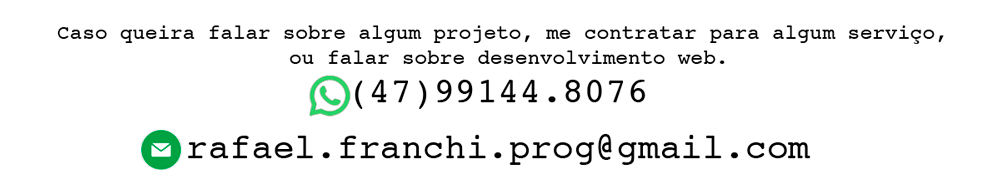

  

Desde os 8 anos apaixonado por tecnologia, meu primeiro computador foi um MSX, um dos primeiros computadores pessoais a chegar no Brasil, me lembro até hoje, era um disquete grande, fita k-7 pra guardar dados e ligado na televisão, rsrsrs. E há 2 anos me dediquei a aprofundar ainda mais nesse mundo tecnológico. Decidi então formalizar meu conhecimento. Cursando atualmente Tecnologo de Análise e Desenvolvimento de Sistemas, e com vários cursos livres em diversas linguagens e aplicaçãoes. E acho que estou pronto pra entrar nesse mercado de trabalho que cresce cada vez mais.

  

  
 

